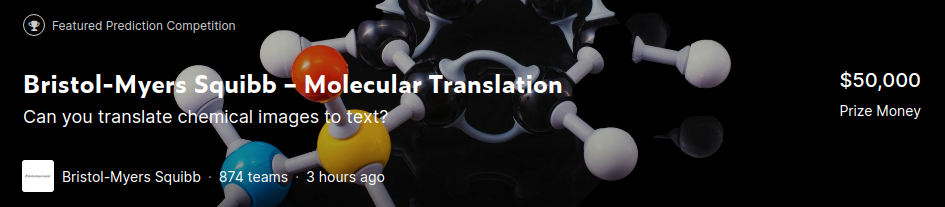
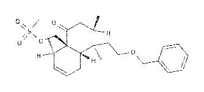
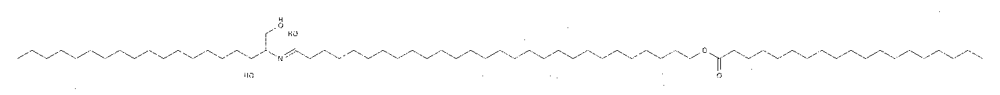
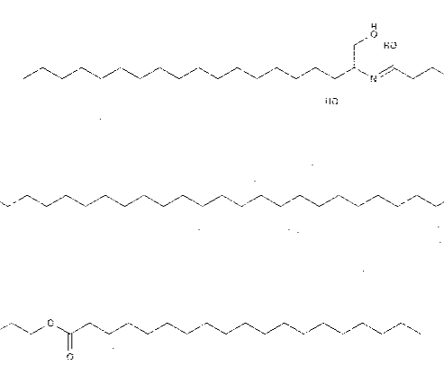

# [Bristol-Myers Squibb – Molecular Translation](https://www.kaggle.com/c/bms-molecular-translation)

LB=0.97,  PB=0.97, rank=30, top 5%

## EDA

化学分子翻译，将化学分子图像翻译成国际化合物标识(InChI)，如下图所示：

`InChI=1S/C24H34O5S/c1-18-9-8-12-21-23(3,13-14-28-16-20-10-6-5-7-11-20)19(2)15-22(25)24(18,21)17-29-30(4,26)27/h5-11,18-19,21H,12-17H2,1-4H3/t18-,19+,21-,23+,24-/m0/s1`

这是图像字幕生成(Image Caption)任务，生成图像的对应释意。需要使用CNN或其他方法提取图像特征，然后使用LSTM等方法进行解码，输出对应的释意。

训练数据有2,424,183张，测试集有1,616,107张，数据规模极大。

## Metric

[Levenshtein Distance](http://en.wikipedia.org/wiki/Levenshtein_distance)

## Solution

* LSTM

  

​      使用[EfficientNet-B4](https://arxiv.org/abs/1905.11946)作为主干网络，对图像进行编码，使用LSTM进行解码。

* TNT

  

​      [Transformer in Transformer](https://arxiv.org/abs/2103.00112)作为编码模块，[Transformer](https://arxiv.org/abs/1706.03762)作为解码模块。

## Tricks

* crop2rect

  数据集中存在部分长宽比例极大的图像，长宽比达到10以上，然而大部分图像的长宽比仅为1.5左右。直接将长宽比极大的图像缩放乘正方形或通用比例(2:1)的长方形，会严重破坏这些图像的信息，扭曲分子结构。如果对这部分图像进行padding，虽然可以保持分子结构，但是产生大量的冗余区域(padding区域)，会造成大量计算资源的浪费。另外，部分图像的长度超过1000像素，而宽度仅有100像素，padding的方法会导致有效区域过小，网络难以提取有效信息。

  

  依赖于transformer的强大位置编码能力，将数据集中的图像切块，然后拼接成近似正方形，这种方法一方面可以保持分子的结构不发生扭曲，另一方面没有padding区域，不会造成计算资源的浪费，有效区域过小等问题。transformer具有强大的位置编码能力，在训练过程中，可以学习到图像的拼接关系，从而还原成原图，相较于直接缩放图像的方法，这种切割拼接的方法可以获得较大的提升。切割拼接的方法如下图所示：

  

​		根据实验结果，在TNT中，相较于直接缩放成224*224大小的图像的方法，切割拼接后再缩放成224大小的方法，可以获得0.2左右的LB提升，padding的方法		分数反而会下降。

​		由于LSTM的位置编码能力较弱，相同的方法，LB反而会下降。

* re-weight-attention

  

  如`tnt/fairseq_transformer.py`中的`TransformerDecode_rew`所示，对attention重新赋予权重，可以一定程度上对模型进行优化。

## Requirements

* pytorch>=1.7.0
* torchvision
* tensorboard
* fairseq
* timm
* rdkit
* albumentations

## RUN

* dataset

  

  下载数据集，解压到`data`文件夹

* 分词与LSTM训练

  

  `CUDA_VISIBLE_DEVICES=0 python train_lstm.py -v lstm-eb4`

  

  会直接进行分词等预处理，处理结束之后开始LSTM的训练。

  

  单折的单模型，LB在2.18左右，经过beamsearch之后可以达到2.04左右，5折ensemble之后，可以达到1.3左右；

* TNT

  

  `cd tnt`

  

  修改`run_train.py`中的fold等超参数

  

  `CUDA_VISIBLE_DEVICES=0 python run_train.py`

  

  在loss长时间不再下降时，终止训练，降低学习率，修改初始化模型路径，继续训练，一直到损失无法降低，完全收敛(train loss 在0.003左右)

  

  单折的单模型，LB在2.16左右， folds ensemble之后，可以达到1.54左右；

  

* TNT-crop

  

  去掉`dataset.py`138行`image = crop_image_to_rect(image)`的注释，进行图像的切割，重复TNT的训练步骤；

  

  单折的单模型，LB在2.03左右；

  

* fine-tuning with re-weight-attention

  

  使用re-weight-attention的方法，对TNT的训练模型进行微调；

  

  `tnt\run_train.py`中的`Net()`改为`Net(rew=True)`

  

  修改`initial_checkpoint`为TNT中训练好的模型路径；

  

  修改`net.load_state_dict(state_dict, strict=True)`-->`net.load_state_dict(state_dict, strict=False)`

  

  学习率从0.0001开始微调，一直下降到1e-6，损失可以从0.003降低到0.002；

  

  微调之后，单折单模型，LB从2.18左右下降到2.12左右；

  

  由于时间与计算资源限制，仅微调了一个fold；

  

* ensemble

  

  修改`run_submit_ensemble_tnt_lstm.py`中模型路径

  

  `CUDA_VISIBLE_DEVICES=0 run_submit_ensemble_tnt_lstm.py --which 0`

  

  `CUDA_VISIBLE_DEVICES=0 run_submit_ensemble_tnt_lstm.py --which 1` 

  ...

  训练完成后将生成的csv文件合起来，生成可提交文件；

* norm

  使用Rdkit进行后处理，修改一些错误预测；

  `while [ 1 ]; do python norm_sub.py -p /path/to/submit.csv && break; done`

  

* post-process

  进行结果层面的集成

  

  找处上面各种方法对同一张图的预测结果，统计相同结果的数量，使用该结果当成这张图像的最终预测结果，如果预测结果均不相同，使用所有方法的ensemble的预测；

  

  修改`post_process.py`中的csv文件路径，运行`python post_process.py`

  

  得到的提交文件理论上应该大于0.97

  

